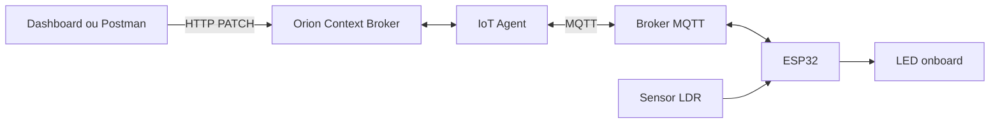

# Smart Lamp


Projeto acadêmico de uma lâmpada inteligente conectada ao ecossistema **FIWARE**. A solução permite ligar e desligar o LED onboard de um ESP32 e acompanhar a luminosidade captada por um sensor LDR.

> Projeto desenvolvido pelo grupo **Starlight**, turma 1ESPH — FIAP.

## Links da entrega

- **Repositório do projeto:** [github.com/EstelaMariano/CP4-Edge-Computing](https://github.com/EstelaMariano/CP4-Edge-Computing)
- **Código do ESP32:** [cp4-edge.ino](https://github.com/EstelaMariano/CP4-Edge-Computing/blob/main/cp4-edge.ino)
- **Simulação no Wokwi:** [Smart Lamp — ESP32 e LDR](https://wokwi.com/projects/474868630235272193)
- **Dashboard:** [dashboard-smart-lamp.vercel.app](https://dashboard-smart-lamp.vercel.app/)
- **Vídeo demonstrativo:** **Link público: https://youtu.be/1DirWqW_ODo?si=yMi26Zp11zkui_P1
- **Repositorio Dashboard:** https://github.com/EstelaMariano/site-smart-lamp.git

## Sobre o projeto

A **Smart Lamp** é uma solução de Internet das Coisas desenvolvida com ESP32, sensor de luminosidade LDR, MQTT e FIWARE.

O sistema realiza comunicação nos dois sentidos:

- **Cloud to Edge:** comandos enviados pelo Postman ou pelo dashboard chegam ao ESP32 e controlam o LED onboard;
- **Edge to Cloud:** o ESP32 lê o nível de luminosidade pelo sensor LDR e envia o valor ao FIWARE.

## Funcionalidades

- Acionamento remoto do LED onboard do ESP32;
- comandos para ligar e desligar enviados pelo Postman;
- controle do LED por meio do dashboard;
- comunicação entre a aplicação web e o Orion Context Broker;
- integração do FIWARE com o ESP32 utilizando MQTT;
- leitura da luminosidade por um módulo LDR;
- publicação periódica do valor da luminosidade;
- envio do estado atual do LED ao FIWARE;
- acompanhamento das mensagens pelo Serial Monitor;
- simulação completa no Wokwi;
- funcionamento em bancada com o ESP32 e o LDR físicos.

## Arquitetura da solução



O Postman ou o dashboard envia um comando ao Orion Context Broker. O comando é encaminhado pelo IoT Agent e pelo Broker MQTT até o ESP32.

O ESP32 interpreta a mensagem recebida, liga ou desliga o LED onboard e publica novamente o estado da saída e o valor de luminosidade.

## Tecnologias utilizadas

| Camada | Tecnologias |
| --- | --- |
| Hardware | ESP32 e módulo sensor LDR de 4 pinos |
| Firmware | Arduino IDE e C++ |
| Biblioteca MQTT | PubSubClient |
| Conectividade | Wi-Fi e MQTT |
| Plataforma IoT | FIWARE, Orion Context Broker e IoT Agent |
| Front-end | React e Vite |
| Testes da API | Postman |
| Infraestrutura | AWS EC2 e Docker |
| Deploy do dashboard | Vercel |
| Simulação | Wokwi |

## Componentes físicos

- 1 ESP32;
- 1 módulo LDR de 4 pinos;
- protoboard;
- jumpers;
- cabo USB para alimentação e gravação do ESP32.

## Ligações principais

| Componente | ESP32 |
| --- | --- |
| LED onboard | GPIO 2 |
| Saída analógica do LDR | GPIO 34 |
| VCC do LDR | 3,3 V |
| GND do LDR | GND |

> É importante conferir a tensão aceita pelo modelo do módulo LDR antes de conectá-lo ao ESP32.

## Comunicação MQTT

O dispositivo provisionado utiliza o identificador `lamp002`.

| Finalidade | Tópico MQTT |
| --- | --- |
| Receber comandos | `/TEF/lamp002/cmd` |
| Publicar o estado do LED | `/TEF/lamp002/attrs` |
| Publicar a luminosidade | `/TEF/lamp002/attrs/l` |

### Comandos recebidos pelo ESP32

Para ligar o LED:

```text
lamp002@on|
```

Para desligar o LED:

```text
lamp002@off|
```

### Dados publicados pelo ESP32

Estado do LED ligado:

```text
s|on
```

Estado do LED desligado:

```text
s|off
```

O valor analógico lido pelo LDR é convertido para uma escala de `0` a `100` antes de ser publicado no Broker MQTT.

## Como executar o projeto

### 1. Iniciar a infraestrutura FIWARE

Utilize como referência o projeto [FIWARE Descomplicado](https://github.com/fabiocabrini/fiware), que contém os arquivos necessários para executar o Orion Context Broker, IoT Agent, Broker MQTT e demais componentes.

```bash
docker compose up -d
```

Certifique-se de que:

- os containers estão funcionando;
- as portas necessárias estão liberadas;
- o Orion Context Broker está acessível;
- o dispositivo `lamp002` foi provisionado;
- o Broker MQTT está ativo.

### 2. Configurar o ESP32

Na Arduino IDE:

1. Instale o suporte à placa ESP32;
2. instale a biblioteca `PubSubClient`;
3. abra o arquivo `cp4-edge.ino`;
4. configure o nome da rede Wi-Fi;
5. configure a senha da rede;
6. informe o IP ou domínio do Broker MQTT;
7. selecione a placa ESP32;
8. selecione a porta correta;
9. compile e envie o código;
10. abra o Serial Monitor em `115200 baud`.

Exemplo de configuração:

```cpp
const char* default_SSID = "SUA_REDE";
const char* default_PASSWORD = "SUA_SENHA";
const char* default_BROKER_MQTT = "IP_OU_DOMINIO_DO_BROKER";
const int default_BROKER_PORT = 1883;
```

> Não é recomendado publicar senhas ou outras credenciais pessoais em repositórios públicos.

### 3. Configurar o dashboard

No projeto React, crie um arquivo `.env` na raiz:

```env
VITE_ORION_URL=http://SEU_IP_PUBLICO:1026
```

Depois, instale as dependências:

```bash
npm install
```

Inicie o projeto:

```bash
npm run dev
```

O dashboard também está disponível publicamente em:

[https://dashboard-smart-lamp.vercel.app/](https://dashboard-smart-lamp.vercel.app/)

> Para que o dashboard controle o ESP32, a infraestrutura FIWARE deve estar ativa e acessível pelo endereço configurado.

## Testes pelo Postman

Para enviar comandos ao ESP32, utilize uma requisição `PATCH`.

### Endpoint

```text
http://SEU_IP_PUBLICO:1026/v2/entities/urn:ngsi-ld:Lamp:002/attrs
```

### Headers

| Chave | Valor |
| --- | --- |
| `Content-Type` | `application/json` |
| `fiware-service` | `smart` |
| `fiware-servicepath` | `/` |

### Body para ligar o LED

```json
{
  "command": "on"
}
```

### Body para desligar o LED

```json
{
  "command": "off"
}
```

## Fluxo de funcionamento

1. O ESP32 conecta-se à rede Wi-Fi;
2. o ESP32 conecta-se ao Broker MQTT;
3. o dispositivo inscreve-se no tópico de comandos;
4. o usuário envia o comando `on` ou `off` pelo Postman ou dashboard;
5. o Orion Context Broker recebe a requisição;
6. o IoT Agent encaminha o comando ao Broker MQTT;
7. o ESP32 recebe e interpreta a mensagem;
8. o LED onboard é ligado ou desligado;
9. o ESP32 publica o estado atualizado do LED;
10. o sensor LDR realiza a leitura da luminosidade;
11. o ESP32 publica o valor da luminosidade no FIWARE.

## Simulação no Wokwi

A simulação pública está disponível em:

[https://wokwi.com/projects/474868630235272193](https://wokwi.com/projects/474868630235272193)

A simulação representa:

- o ESP32;
- o LED onboard;
- o sensor de luminosidade;
- a conexão Wi-Fi;
- a comunicação com o Broker MQTT;
- o recebimento dos comandos;
- o envio dos dados de luminosidade.

## Demonstração da solução

A demonstração apresenta os dois sentidos da comunicação entre o ESP32 e o FIWARE.

### Cloud to Edge

Os comandos `on` e `off` são enviados pelo Postman ao Orion Context Broker e encaminhados ao ESP32. Ao receber o comando, o ESP32 liga ou desliga o LED onboard.

### Edge to Cloud

O ESP32 realiza a leitura do sensor LDR e publica o valor da luminosidade no FIWARE por meio do Broker MQTT.

### Hands-on

O funcionamento da solução também é demonstrado fisicamente em bancada, utilizando o ESP32 equipado com o módulo LDR.

## Vídeo demonstrativo

O vídeo público de até três minutos demonstra:

1. a execução da simulação no Wokwi;
2. a conexão do ESP32 com a rede e o Broker MQTT;
3. o envio dos dados de luminosidade ao FIWARE;
4. o envio dos comandos `on` e `off` pelo Postman;
5. o LED onboard ligando e desligando;
6. as informações exibidas no Serial Monitor;
7. o funcionamento físico do ESP32 com o sensor LDR.

- **Nome do vídeo:** `ADICIONAR NOME DO VÍDEO`
- **Link público:** `ADICIONAR LINK DO VÍDEO`

## Créditos

O firmware foi desenvolvido com base no material **FIWARE Descomplicado**, criado por **Fábio Henrique Cabrini**, com contribuições anteriores de **Lucas Demetrius Augusto**.

A adaptação do firmware, a configuração do dispositivo, a integração com o FIWARE, a montagem da solução e o desenvolvimento do projeto Smart Lamp foram realizados pelo grupo **Starlight**.

## Integrantes

| Nome | RM | Turma |
| --- | --- | --- |
| Beatriz Soares Salve          | RM568791 | 1ESPH |
| Estela Mariano da Silva       | RM569513 | 1ESPH |
| Gabriela Correa Pinon Labrada | RM569849 | 1ESPH |
| Lucca Savoia Bergamasco Diniz | RM569489 | 1ESPH |

## Contexto acadêmico

Projeto desenvolvido para a disciplina de **Edge Computing & Computer Systems**, na FIAP, como aplicação prática dos conceitos de:

- Internet das Coisas;
- computação em nuvem;
- comunicação MQTT;
- APIs REST;
- FIWARE;
- integração entre cloud e edge;
- sensores e microcontroladores.

---

Desenvolvido pelo grupo **Starlight**.
